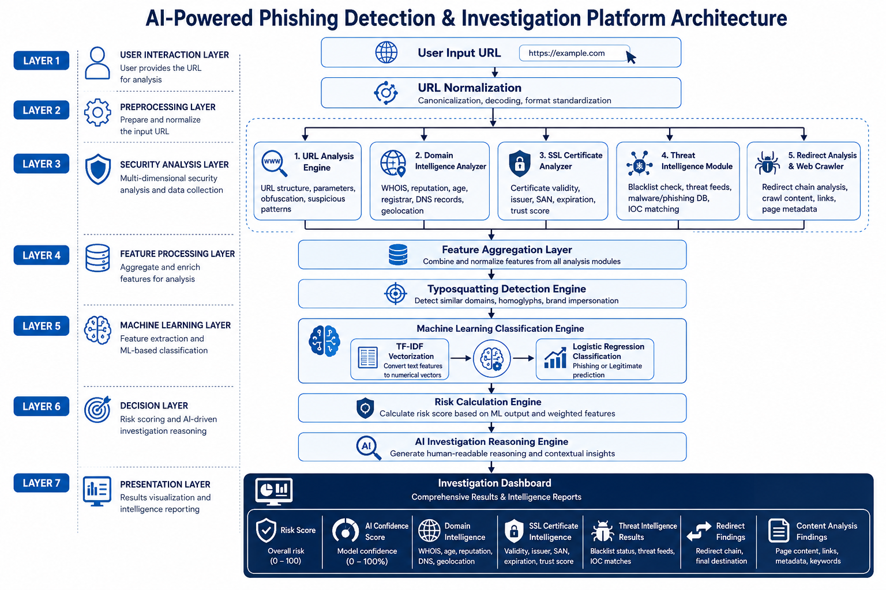

# AI-Powered Phishing Detection & Investigation Platform

A hybrid phishing detection and investigation platform that combines Machine Learning, URL analysis, SSL certificate inspection, domain intelligence, threat intelligence integration, redirect analysis, and crawler-based detection to identify malicious websites.

---

## Overview

The platform performs multi-layer phishing analysis by combining machine learning predictions with security-focused heuristic checks. It investigates URLs using domain intelligence, SSL certificate validation, threat intelligence feeds, redirect analysis, content inspection, and risk scoring techniques to provide a comprehensive phishing assessment.

---

## Key Features

- Machine Learning URL Classification
- URL Structure Analysis
- Domain Intelligence & WHOIS Analysis
- SSL Certificate Inspection
- Threat Intelligence Integration
- Redirect Behaviour Analysis
- Typosquatting Detection
- Content-Based Security Checks
- Risk Scoring Engine
- AI-Based Investigation Reasoning
- Interactive Web Dashboard

---

## Technologies Used

### Backend
- Python
- Flask

### Machine Learning
- Scikit-learn
- TF-IDF Vectorization
- Logistic Regression

### Security & Analysis
- WHOIS
- Requests
- BeautifulSoup
- SSL Inspection
- Google Safe Browsing API

### Frontend
- HTML
- CSS
- JavaScript

---

## Architecture



---

## Dashboard


---

## Project Modules

### URL Analyzer
Analyzes URL structure, suspicious patterns, subdomains, redirects, and phishing indicators.

### Domain Analyzer
Collects domain intelligence including WHOIS information, registration details, DNS information, and domain age.

### SSL Analyzer
Validates SSL certificates and extracts certificate details such as issuer, organization, country, validity, and expiration.

### Threat Intelligence Module
Integrates external threat intelligence services to verify domain reputation and phishing status.

### Redirect Analyzer
Tracks redirect chains and identifies suspicious redirect behaviour.

### Content Analysis Engine
Inspects webpage content for phishing indicators such as login forms, password fields, and suspicious keywords.

### Machine Learning Engine
Uses TF-IDF vectorization and Logistic Regression to classify URLs as legitimate or phishing.

### Risk Calculator
Combines machine learning predictions with security analysis results to generate an overall risk score.

---

## Installation

### Clone Repository

```bash
git clone https://github.com/ompatel4624/AI-Phishing-Investigation-Platform.git
cd AI-Phishing-Investigation-Platform
```

### Install Dependencies

```bash
pip install -r requirements.txt
```

### Run Application

```bash
python app.py
```

### Access Dashboard

```text
http://127.0.0.1:5000
```

---

## Sample Analysis Capabilities

- Risk Score Generation
- Machine Learning Confidence Scoring
- SSL Certificate Validation
- Domain Reputation Analysis
- Threat Intelligence Verification
- Redirect Tracking
- Phishing Indicator Detection
- AI-Based Security Reasoning

---

## Future Enhancements

- Browser Extension Integration
- Real-Time URL Monitoring
- Expanded Threat Intelligence Sources
- Advanced Machine Learning Models
- Automated Investigation Reports
- Email Phishing Analysis
- SIEM Integration

---

## Author

**Om Patel**
Network & Hardware Engineer | Cyber Security Student
GitHub: https://github.com/ompatel4624
