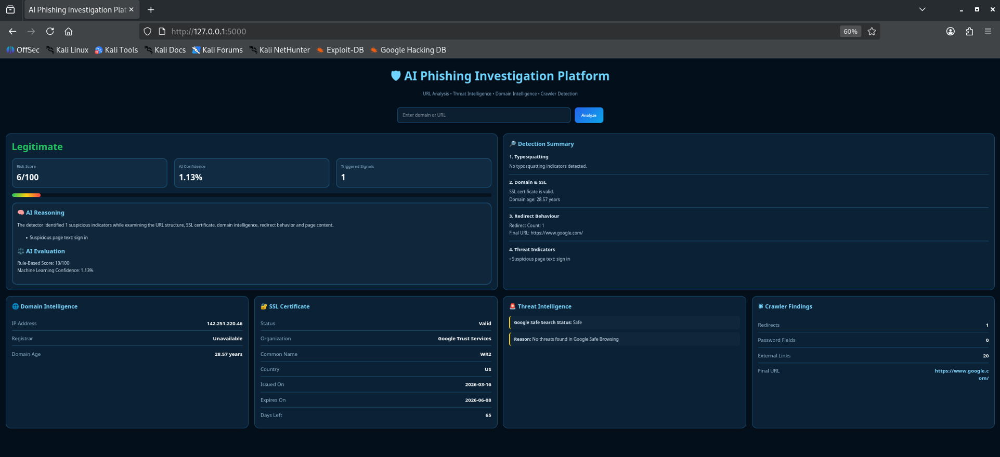

# AI-Powered Phishing Detection & Investigation Platform

## Overview
Hybrid phishing detection platform combining Machine Learning, URL analysis, SSL inspection, WHOIS intelligence, and threat intelligence.

## Features
- Machine Learning URL Classification
- SSL Certificate Analysis
- Domain Reputation Analysis
- WHOIS Intelligence
- Google Safe Browsing Integration
- Typosquatting Detection
- Redirect Analysis
- Risk Scoring Engine

## Technologies Used
- Python
- Flask
- Scikit-learn
- BeautifulSoup
- Requests
- WHOIS
- HTML/CSS

## Architecture
[Add diagram here]

## Installation
[Commands here]

## Screenshots

## Future Enhancements
- Real-time monitoring
- Browser extension
- Threat intelligence expansion
